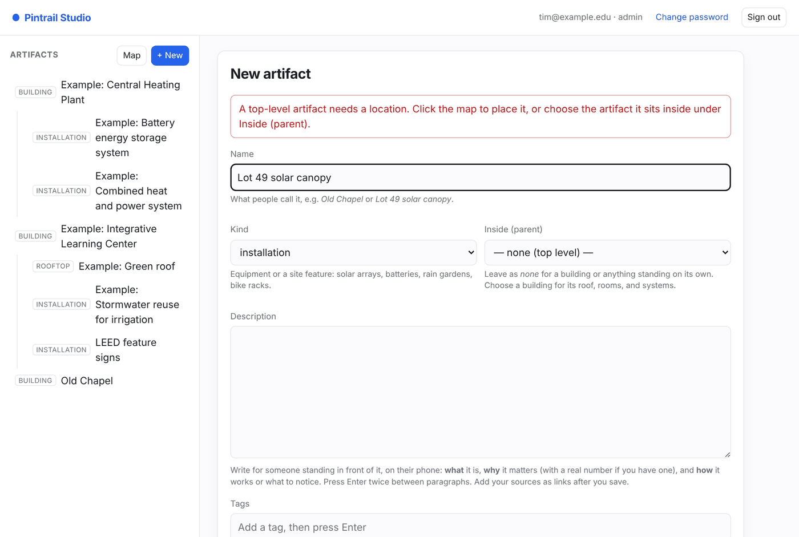
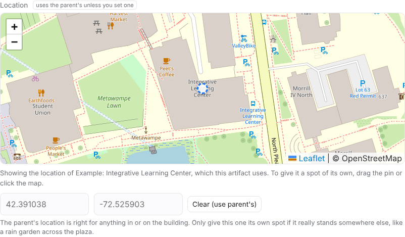
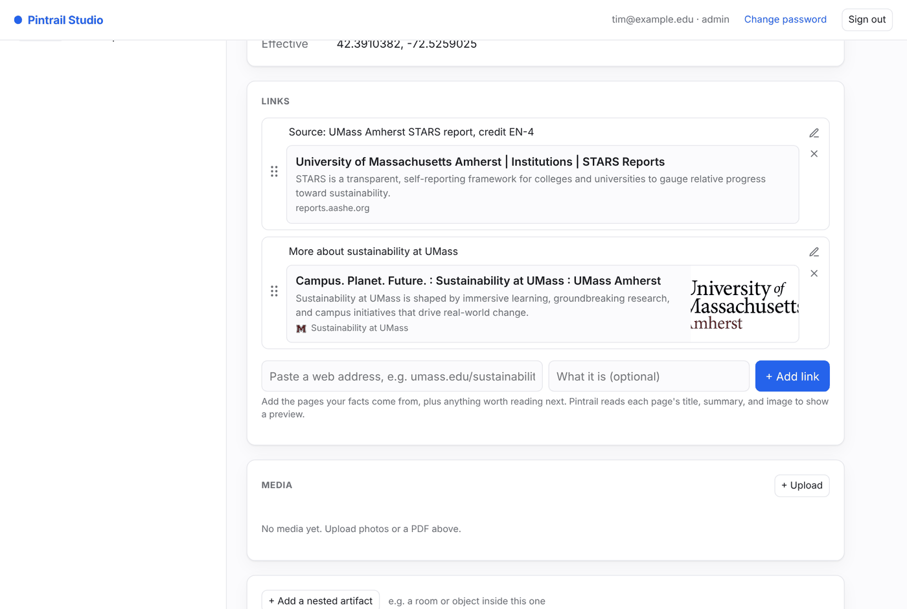
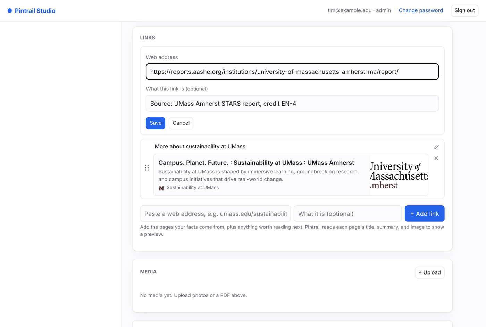
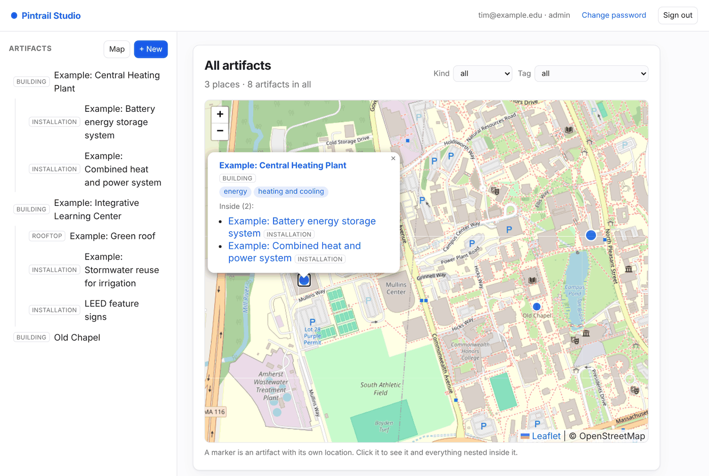

# Adding artifacts in the Pintrail Studio

A step-by-step guide for authors adding campus artifacts to Pintrail. The Studio also has a fuller manual built in: click **Help** at the top of the Studio.

An **artifact** is anything on campus worth stopping for: a building, a room, a rooftop, a piece of art, or an installation such as a solar canopy or a rain garden. Artifacts can sit **inside** other artifacts. A building can hold its green roof, its stormwater system, or a room, and those can hold their own artifacts in turn. Later, artifacts get grouped into **trails** that people walk with the Pintrail app.

You do all of this in the **Studio**, a website you use in your browser:

**https://pintrail.cs.umass.edu/studio**

## Before you start

You need a Studio account. Your instructor creates it and gives you two things:

- the email address the account uses, and
- a **temporary password**.

## 1. Sign in, choose your password, and fill in your profile

Go to the Studio and sign in with your email and the temporary password.

The first time you sign in, the Studio asks you to choose your own password. Enter the temporary password as your current password, then a new one of **at least 12 characters**, twice. You can't do anything else until you've done this.

Next, the Studio asks for your **profile**. Your full name is required; everything else is optional:

- **Display name**: what people call you, if that's different from your full name. The Studio shows it instead of your full name.
- **Pronouns**, **affiliation** (for example *COMPSCI 326 student*), and a **short bio**.
- **Photo**: click **Add a photo**. A clear photo of your face helps classmates and reviewers know who's who. On a phone you can take one with the camera. It's cropped to a square from the middle.

Your name and photo appear on the artifacts you add, in the review list, and in each artifact's history. To change your profile or your password later, click your name or photo at the top right.

## 2. Find your way around

The Studio has two parts:

- **The sidebar on the left** lists every artifact. Artifacts that sit inside another one are indented beneath it. Click any artifact to open it.
- **The main area** shows the artifact you opened, or the form when you create or edit one.
- **Map**, **Trails**, and **Topics**, at the top of the sidebar, show every artifact on one map (see [step 8](#8-see-everything-on-the-map)), the trails ([step 11](#11-build-a-trail)), and the topics ([step 12](#12-link-artifacts-to-a-topic)).
- **Only mine**, above the list, shows just the artifacts you added.
- The **coloured dot** next to each artifact is its review status: grey for draft, orange for ready for review, green for approved (see [step 10](#10-submit-your-artifact-for-review)).

## 3. Look at the examples first

Artifacts whose names start with **"Example:"** are worked examples. Open them before you write your own, and use them as a model:

- **Example: Integrative Learning Center** holds *Example: Green roof* and *Example: Stormwater reuse for irrigation*.
- **Example: Central Heating Plant** holds *Example: Combined heat and power system* and *Example: Battery energy storage system*.

At the bottom of a building's page, **Nested inside** lists the artifacts inside it.

The examples are approved and belong to no student, so you can read them but not edit or delete them. Everyone uses them as a reference.

## 4. Add an artifact

Adding an artifact takes two steps. First you create it with just its name and where it is. Then you fill in everything else on its page.

**Step 1: create it.** Click **+ New** at the top of the sidebar. The form asks for three things:

| Field | What to enter |
|---|---|
| **Name** | What people call it, for example *Old Chapel* or *Lot 49 solar canopy*. |
| **Inside (parent)** | Leave as **none (top level)** for a building or anything standing on its own. To put it inside another artifact, choose that artifact (see step 5). |
| **Location** | **Required for a top-level artifact.** Click the map where the artifact is, and a pin appears. Zoom in first (the **+** button, or scroll) so you can place it precisely. The latitude and longitude boxes fill in for you. You can also type or paste coordinates into the boxes and the pin moves to match. A pair copied from Google Maps, like `42.3891, -72.5281`, can be pasted straight into the latitude box. |

**Step 2: fill it in.** Click **Create**. The artifact opens, appears in the sidebar, and shows a checklist of what to add next. Click **Edit** to add:

| Field | What to enter |
|---|---|
| **Kind** | One of `building`, `room`, `artwork`, `installation`, `rooftop`, or `other`. Use `installation` for equipment and site features (solar arrays, batteries, rain gardens, bike racks). A new artifact starts as `other` until you choose. |
| **Description** | The heart of the artifact. See [Writing a good description](#writing-a-good-description) below. |
| **Tags** | Themes someone might look for, such as *solar*, *stormwater*, or *energy storage*. Type a tag and press **Enter**; click **×** on a tag to remove it. As you type, existing tags are suggested: pick one when it fits, so the same theme isn't spelled two ways. |

Then add your sources under **Links** (step 6) and a photo under **Media** (step 7), right on the artifact's page. The checklist ticks each one off, and goes away once everything is there.

**Check the pin before you click Create.** Zoom in and make sure it sits on the right building or spot, not on the one next door. The pin is what the app uses to tell someone they're nearby.

If something is missing, the form stays open with a red note at the top saying what to fix, and everything you typed is kept. The most common one: a top-level artifact with no location. Place it on the map, or choose the artifact it sits inside.

To change anything later, open the artifact and click **Edit**.

## 5. Add an artifact inside another one

Many sustainability features belong to a building: its roof, its heating system, a sign in its lobby. Add those *inside* the building, so the app can show them together.

1. Open the building.
2. Scroll to the bottom and click **+ Add one inside** (or **+ Add a nested artifact**).
3. The form opens with **Inside (parent)** already set to that building.

**Usually, leave the location as it is.** The map opens on the parent's location, marked with a hollow, dashed pin, and the coordinate boxes show the parent's numbers in grey. That's the location this artifact uses, which is right for anything in or on the building.

If the feature really is somewhere else, such as a rain garden across the plaza, **drag the pin** to the right spot, or click the map. The pin turns solid, and the artifact now has its own location. **Clear (use parent's)** puts it back.

Leaving it on the parent's location matters: if someone later corrects the building's pin, everything inside it moves with it. After you save, the page shows where the location came from: **inherited from** the parent.

If you put something in the wrong parent, click **Edit** and change **Inside (parent)**.

## 6. Add links to your sources

Every fact should come from somewhere a reader can check. On an artifact's page, the **Links** section takes web addresses:

1. Paste the address into the first box. You can leave off `https://`.
2. Optionally, say what the link is in the second box, for example *Source for the energy figures*.
3. Click **+ Add link**. Pintrail reads the page and shows a preview with its title, summary, and image, like a link pasted into Notion or Slack. This takes a few seconds.

- **To edit** a link's address or its note, click the pencil. Change the address and Pintrail reads the new page for a fresh preview.
- **To reorder**, drag a link by the grip (the six dots) on its left. You can also click the grip and use the up and down arrow keys. Put the most important source first.
- **To remove** a link, click **×**.

Some sites don't offer a preview. The link still works; it just shows the address instead of a title.

## 7. Add photos and PDFs

On an artifact's page, the **Media** section has a **+ Upload** button. You can pick several photos and PDFs at once.

- New uploads show **processing…** for a moment while Pintrail makes thumbnails. The page updates by itself.
- If one shows **failed**, remove it with the **✕** and try again. If it keeps failing, tell your instructor.
- Use photos you took yourself, or that you have permission to use. A clear photo of the thing itself is worth more than several distant ones.

## 8. See everything on the map

Click **Map** at the top of the sidebar to see every artifact on one map. Each marker is an artifact with its own location; click it to see its name and tags, and the artifacts nested inside it. Click any name to open that artifact.

Use **Kind**, **Status**, and **Tag** above the map to show only, say, installations, or only artifacts tagged *solar*. It's a quick way to spot a pin in the wrong place, or a part of campus nobody has covered yet.

## 9. On your phone

The Studio works in your phone's browser, so you can add artifacts while standing in front of them.

- **The artifact list** is behind the menu button (☰) at the top left. Tap an artifact to open it, and the list closes.
- **Use my location**, under the map in the form, puts the pin where your phone is. The first time, your phone asks whether to share your location with the site: allow it. The pin comes with a shaded circle showing how accurate the reading is. Outdoors that's usually within 5 to 15 metres. Indoors it can be much worse, so always check the pin and drag it to the exact spot.
- **Take photo**, in the Media section, opens your camera. Each photo uploads straight away and shows *processing…* for a moment. **+ Upload** picks photos from your library instead.
- **To scroll the page**, drag outside the map. Dragging on the map moves the map.

If your phone says location access is blocked, turn it back on for the site in your browser's settings (on an iPhone: Settings → Privacy & Security → Location Services → Safari Websites), or place the pin by tapping the map.

## 10. Submit your artifact for review

Every artifact starts as a **Draft**. When it's finished, with a good description, its sources, and a photo, open it and click **Submit for review** in the Review card. Its status changes to **Ready for review**, and your instructor sees it in their review list.

- Changed your mind? Click **Withdraw** to take it back and keep working.
- If it comes back **sent back for changes**, the note at the top of the Review card says what to fix. Fix it, then click **Submit for review** again.
- Only **approved** artifacts appear in the Pintrail app. Drafts and artifacts waiting for review are visible only here in the Studio. An artifact inside a building that isn't approved yet stays out of the app until the building is approved too.
- Once it's **Approved**, it's done. If you edit it after that, it goes back to **Ready for review** so the change gets checked too, and it leaves the app until it's approved again.

The coloured dot next to each artifact in the list shows its status: grey for draft, orange for ready for review, green for approved. The map's **Status** filter shows the same thing.

**Whose artifacts you can change.** You can edit and delete only the artifacts you added. You can still add an artifact *inside* someone else's, like a room in a building a classmate created. Tick **Only mine** at the top of the artifact list to see just yours.

**History.** At the bottom of every artifact, **History** lists every change: who made it, when, and what it was before and after. Nothing is lost by editing.

## 11. Build a trail

A trail is a walk through artifacts in order, with a note at each stop. Explorers follow trails in the app.

1. Click **Trails** at the top of the sidebar, then **+ New trail**.
2. Give it a **title** and a **description**: what the walk is about, roughly how long it takes, and where it starts.
3. Choose **who can see it**. Keep it **Private** while you build it. **Anyone with the link** gives you a share code to hand out; the trail isn't listed in the app. Only your instructor can make a trail **Public**, which lists it in the app for everyone.
4. Under **Add a stop**, choose an artifact and, if you like, a note: what to look for there, or how to get there from the last stop. Each new stop goes on the end. A stop can be a building or anything inside one; artifacts inside a building are listed under it, like *Integrative Learning Center › Green roof*.
5. **Drag the grip** (⋮⋮) to put the stops in walking order, or focus the grip and use the arrow keys. The map numbers the stops and joins them with a line, so you can check the route makes sense on the ground.
6. Click the pencil to edit a stop's note, or the × to remove the stop. Removing a stop doesn't change the artifact.

If a stop's artifact isn't approved yet, the trail says so. Explorers see that stop as "not available" until it's approved, so get your artifacts approved before asking for the trail to be made public.

You can edit and delete only the trails you made. Everyone can see every trail in the Studio.

## 12. Link artifacts to a topic

Some information is true of many artifacts. Every bike share station is part of Valley Bike Share; several buildings are LEED certified. Rather than writing the same description six times, write it once as a **topic** and link the artifacts to it. A topic is a page with a name, a description, links, and photos, but no place: it isn't on the map and can't be a trail stop. Each linked artifact shows the topic's description on its own page, so fixing a mistake in the topic fixes it everywhere.

**Start a topic.** Click **Topics** at the top of the sidebar, then **+ New topic**. Give it a name and a description of what is true of *every* artifact that will link to it. Anything that differs from one artifact to the next (a building's LEED level, how many docks a station has) belongs on that artifact, or in the note on its link.

**Add the artifacts.** On the topic's page, under **Linked artifacts**:

- **+ Add a new artifact linked here** opens the New artifact form with the link already set. This is the quick way to add six bike share stations: give each one its name and its spot on the map.
- **Or link one that already exists** lists the artifacts you own. Add a short note if it helps, like *Gold, 2013*.

You can also link from the other side: an artifact's page has a **Topics** card where you choose a topic and add a note. The pencil edits the note and the × removes the link; neither changes the topic or the artifact itself.

The topic's page puts every linked artifact on one map, so you can see the whole set at once. Topics go through review like artifacts, and the app shows a topic only once it's approved.

You can link only artifacts you own. To link a classmate's artifact, ask them or your instructor.

## Writing a good description

Someone will read this standing in front of the artifact, on their phone. Write for them. A good description answers:

- **What it is.** One or two sentences a visitor would understand.
- **Why it matters.** The sustainability story, with a real number where you have one: megawatts, gallons, percent saved, the year it opened.
- **How it works**, or what to notice when you're standing there.
- **Sources.** Add the pages your facts come from as [links](#6-add-links-to-your-sources), not inside the description.

Some tips:

- **Use paragraphs.** Press Enter twice between them. The Studio keeps your line breaks.
- **Write in your own words.** Don't paste text from a website; summarize it and cite it.
- **Only write what you can source.** If you aren't sure of a number, leave it out or ask Ezra Small (Campus Sustainability).
- **Keep it readable on a phone.** A few short paragraphs beats one long one.

The example artifacts follow this pattern, including their tags and source links. Compare yours with them.

## Deleting

**Delete** asks you to confirm, and **it also deletes everything nested inside the artifact**. If you want to keep a nested artifact, first edit it to move it to a different parent.

You can delete only artifacts you added, and only if nothing inside them belongs to someone else and none of them has been approved. If you delete something by mistake, ask your instructor: a deleted artifact can be restored, with everything that was inside it and its photos.

## Getting help

The Studio has its own manual: click **Help** at the top of the page, or press **?** anywhere. Hover over a button or label for a short tip, and click a small **?** next to a heading or field to read about it in a panel without leaving the page.

If something in the Studio doesn't work the way this guide says, email your instructor with a screenshot and the name of the artifact you were working on.
