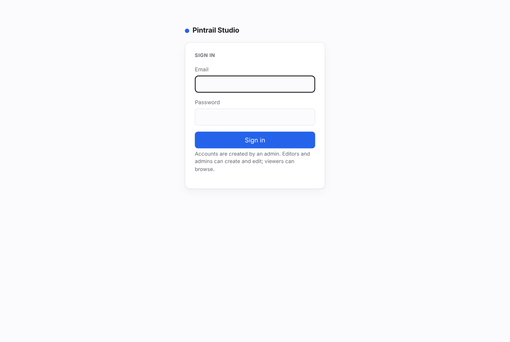
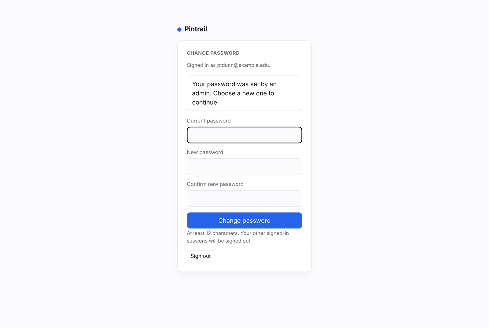
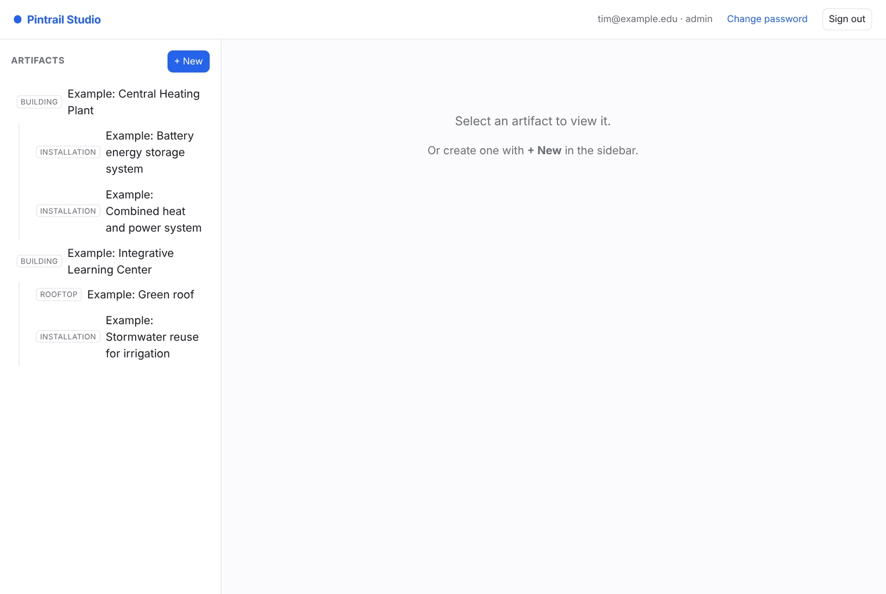
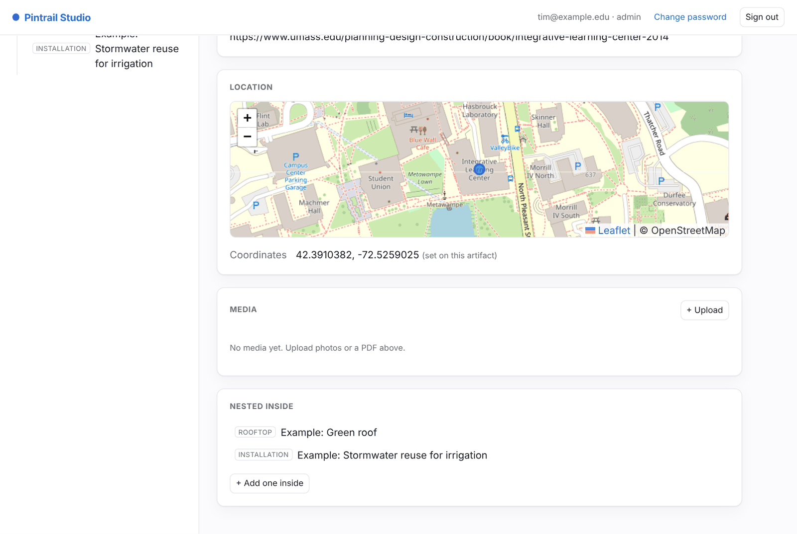
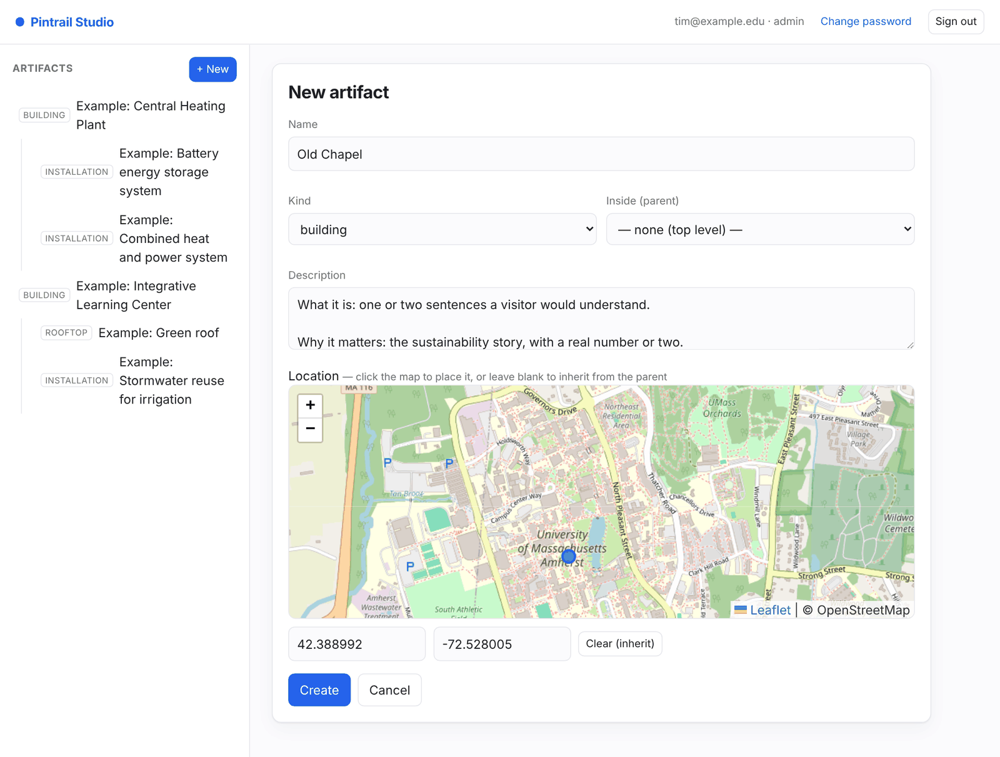
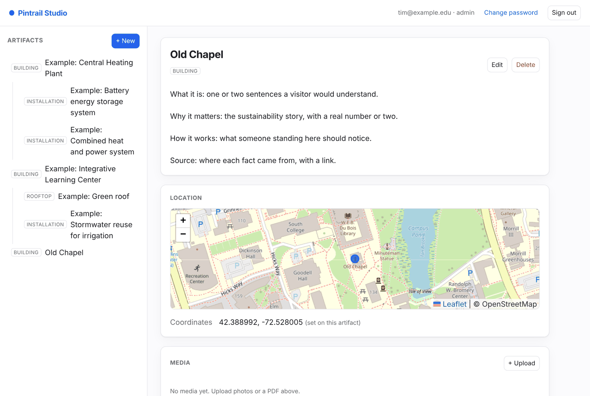
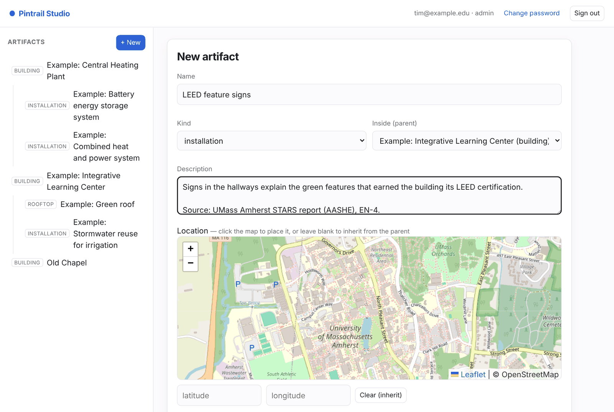
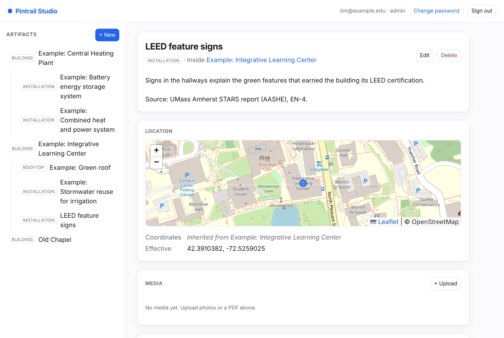

# Adding artifacts in the Pintrail Studio

A step-by-step guide for authors adding campus artifacts to Pintrail.

An **artifact** is anything on campus worth stopping for: a building, a room, a rooftop, a piece of art, or an installation such as a solar canopy or a rain garden. Artifacts can sit **inside** other artifacts. A building can hold its green roof, its stormwater system, or a room, and those can hold their own artifacts in turn. Later, artifacts get grouped into **trails** that people walk with the Pintrail app.

You do all of this in the **Studio**, a website you use in your browser:

**https://pintrail.cs.umass.edu/studio**

## Before you start

You need a Studio account. Your instructor creates it and gives you two things:

- the email address the account uses, and
- a **temporary password**.

## 1. Sign in and choose your own password

Go to the Studio and sign in with your email and the temporary password.

The first time you sign in, the Studio asks you to choose your own password. Enter the temporary password as your current password, then a new one of **at least 12 characters**, twice. You can't do anything else until you've done this.

You can change it again at any time with **Change password** at the top right.

## 2. Find your way around

The Studio has two parts:

- **The sidebar on the left** lists every artifact. Artifacts that sit inside another one are indented beneath it. Click any artifact to open it.
- **The main area** shows the artifact you opened, or the form when you create or edit one.

## 3. Look at the examples first

Artifacts whose names start with **"Example:"** are worked examples. Open them before you write your own, and use them as a model:

- **Example: Integrative Learning Center** holds *Example: Green roof* and *Example: Stormwater reuse for irrigation*.
- **Example: Central Heating Plant** holds *Example: Combined heat and power system* and *Example: Battery energy storage system*.

At the bottom of a building's page, **Nested inside** lists the artifacts inside it.

Please **don't edit or delete the examples**. Everyone uses them as a reference.

## 4. Add an artifact

Click **+ New** at the top of the sidebar. Then fill in the form:

| Field | What to enter |
|---|---|
| **Name** | What people call it, for example *Old Chapel* or *Lot 49 solar canopy*. |
| **Kind** | One of `building`, `room`, `artwork`, `installation`, `rooftop`, or `other`. Use `installation` for equipment and site features (solar arrays, batteries, rain gardens, bike racks). |
| **Inside (parent)** | Leave as **none (top level)** for a building or anything standing on its own. To put it inside another artifact, choose that artifact (see step 5). |
| **Description** | The heart of the artifact. See [Writing a good description](#writing-a-good-description) below. |
| **Location** | Click the map where the artifact is, and a pin appears. Zoom in first (the **+** button, or scroll) so you can place it precisely. The latitude and longitude boxes fill in for you. |

**Check the pin before you save.** Zoom in and make sure it sits on the right building or spot, not on the one next door. The pin is what the app uses to tell someone they're nearby.

Click **Create**. The artifact opens, and it now appears in the sidebar.

To change anything later, open the artifact and click **Edit**.

## 5. Add an artifact inside another one

Many sustainability features belong to a building: its roof, its heating system, a sign in its lobby. Add those *inside* the building, so the app can show them together.

1. Open the building.
2. Scroll to the bottom and click **+ Add one inside** (or **+ Add a nested artifact**).
3. The form opens with **Inside (parent)** already set to that building.

**Usually, leave the location blank.** An artifact with no location of its own takes its parent's location, which is right for anything in or on the building. Only click the map if the feature really is somewhere else, such as a rain garden across the plaza.

After you save, the page shows where the location came from: **inherited from** the parent.

If you put something in the wrong parent, click **Edit** and change **Inside (parent)**.

## 6. Add photos and PDFs

On an artifact's page, the **Media** section has a **+ Upload** button. You can pick several photos and PDFs at once.

- New uploads show **processing…** for a moment while Pintrail makes thumbnails. The page updates by itself.
- If one shows **failed**, remove it with the **✕** and try again. If it keeps failing, tell your instructor.
- Use photos you took yourself, or that you have permission to use. A clear photo of the thing itself is worth more than several distant ones.

## Writing a good description

Someone will read this standing in front of the artifact, on their phone. Write for them. A good description answers:

- **What it is.** One or two sentences a visitor would understand.
- **Why it matters.** The sustainability story, with a real number where you have one: megawatts, gallons, percent saved, the year it opened.
- **How it works**, or what to notice when you're standing there.
- **Source.** Where each fact came from, with a link. Until artifacts support links of their own, put the web address at the end of the description.

Some tips:

- **Use paragraphs.** Press Enter twice between them. The Studio keeps your line breaks.
- **Write in your own words.** Don't paste text from a website; summarize it and cite it.
- **Only write what you can source.** If you aren't sure of a number, leave it out or ask Ezra Small (Campus Sustainability).
- **Keep it readable on a phone.** A few short paragraphs beats one long one.

The example artifacts follow this pattern. Compare yours with them.

## Deleting

**Delete** asks you to confirm, and **it also deletes everything nested inside the artifact**, along with its photos. If you want to keep a nested artifact, first edit it to move it to a different parent.

## Coming soon

- **Trails:** grouping artifacts into a walking route.
- **Tags:** labels such as *solar* or *stormwater*, so artifacts can be found by theme.
- **Links:** proper links on an artifact, so sources don't have to sit inside the description.

## Getting help

If something in the Studio doesn't work the way this guide says, email your instructor with a screenshot and the name of the artifact you were working on.
