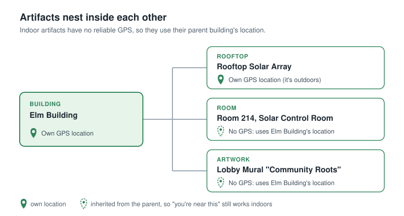
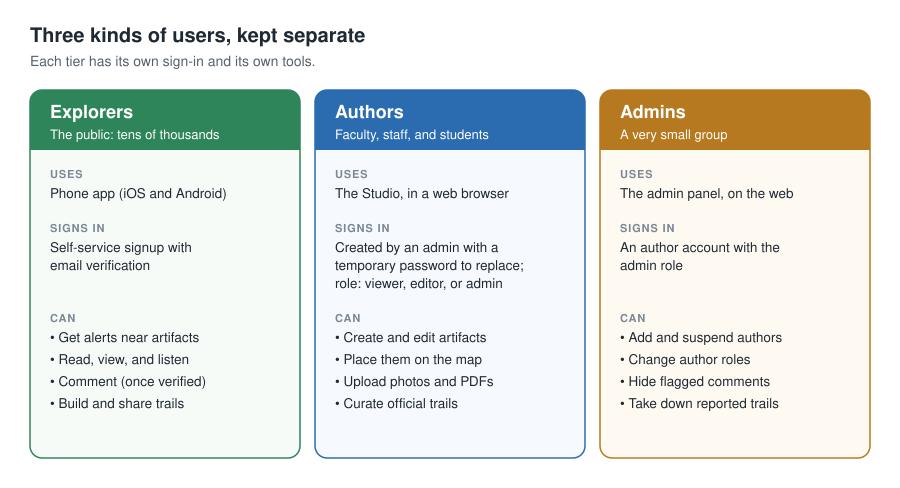
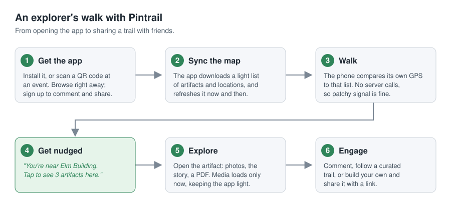
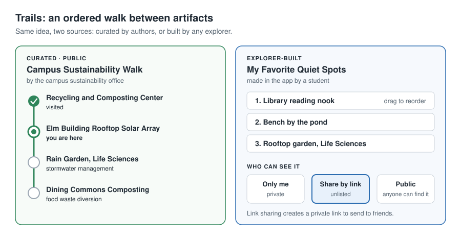
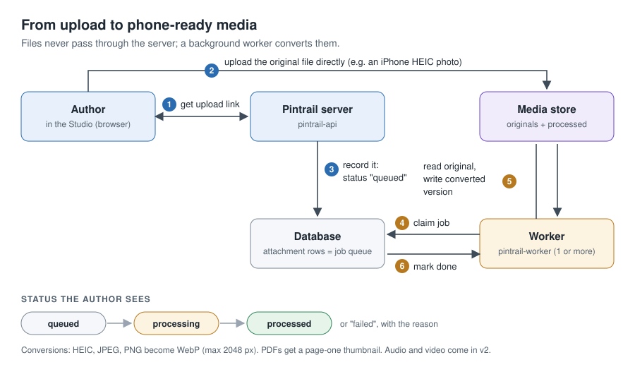
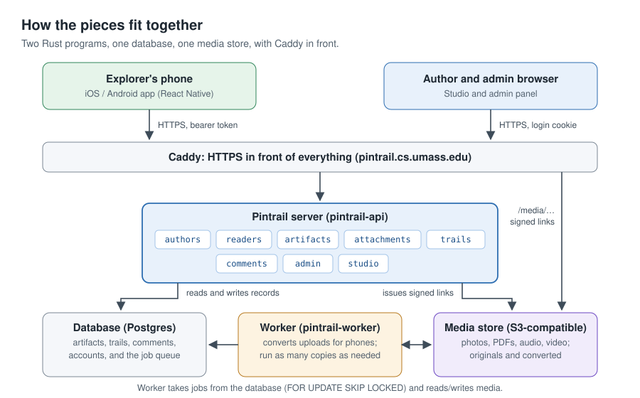
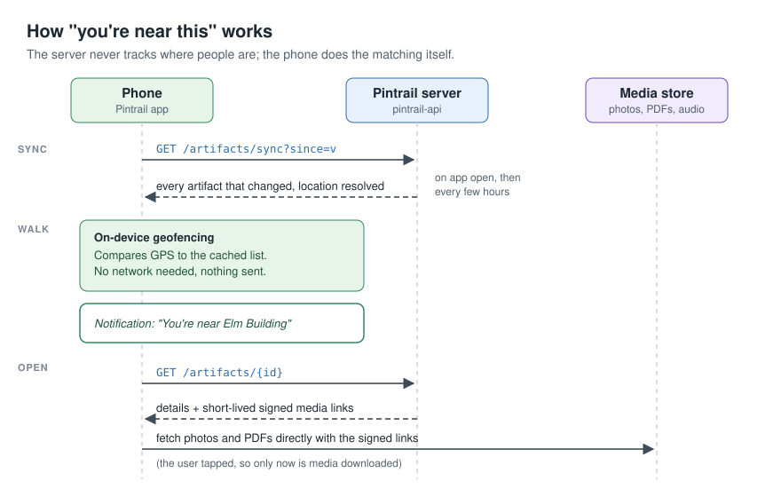
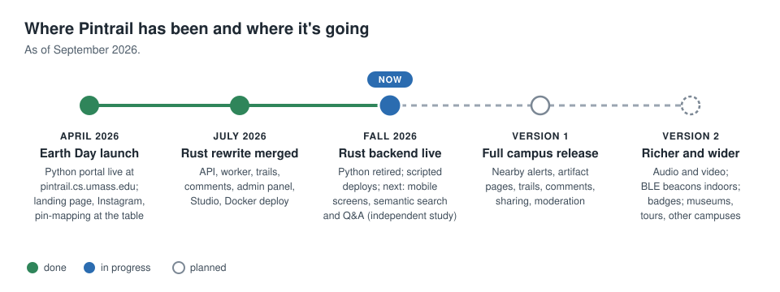

# Pintrail: What It Is, Why It Exists, and How People Use It

*Prepared September 2026 from the project repository (`docs/DESIGN.md`, `docs/DEPLOYMENT.md`, the Rust backend, and the mobile app) and project correspondence. Last updated September 25, 2026.*

---

## 1. What Pintrail is

Pintrail is a location-triggered discovery platform. It connects a phone in someone's pocket to the stories behind the physical places they are walking past.

It is built around two ideas:

- **Artifacts** are the things worth knowing about. An artifact can be a building, a room inside a building, a painting on a wall, a rooftop solar array, a rain garden, or a composting station. Each artifact has a name, a description, a kind (building, room, artwork, installation, rooftop, other), a location, and a set of attachments (photos, PDFs, and later audio and video) that explain what it is and why it matters.
- **Trails** are ordered sequences of artifacts with their own title and theme, meant to be walked in order. "Campus Sustainability Walk," "Museum Highlights," and "Admitted Students Walk" are all trails: the same underlying thing, pointed at different artifacts, with different framing. The same artifact can appear on several trails.

Artifacts nest. A building contains rooms and features, and a room contains objects:

Indoor artifacts usually have no reliable GPS coordinate of their own, so they automatically inherit their parent building's location. "You're near this" still works for them.

## 2. Why it exists

Sustainability work on a campus is mostly invisible. Solar panels sit on rooftops nobody visits, stormwater systems look like landscaping, and composting programs happen behind dining halls. Students and visitors walk past these every day without knowing what they are or why they matter.

Pintrail makes that work discoverable. Instead of reading about environmental efforts on a web page, people encounter them in place, at the moment they are standing near them. The goals are to:

- **Educate** through short, rich, in-place content rather than lectures
- **Engage** by nudging people toward things nearby and giving them trails to follow
- **Connect** the community through comments and user-built trails that add their own voice
- **Make impact visible** by surfacing what the campus is actually doing

Although the first content is about sustainability, nothing in the system is sustainability-specific. That generality is deliberate, so the platform can later host museum tours, admissions walks, historical walks, or partner institutions without new engineering.

## 3. Where it will be used

| Setting | Example use | Status |
|---|---|---|
| **UMass Amherst campus, outdoors** | Sustainability sites: solar arrays, rain gardens, green buildings, composting and recycling | First use case; content being authored now |
| **Inside campus buildings** | Rooms, exhibits, murals, and installations within a building | Supported at building-level precision today; room-level precision planned with BLE beacons |
| **Campus events and tabling** | Earth Day and similar events, where passers-by scan a QR code and explore | Used at the April 2026 Earth Day event |
| **Tours** | Admissions walks, orientation, department open houses | Supported by the trail model; content not yet created |
| **Museums and galleries** | Artwork-by-artwork guides with photos, audio, and PDFs | Designed for; a natural next domain |
| **Other campuses and institutions** | The same platform, different content | Future |

## 4. The people who use it

Pintrail has three kinds of users, kept as separate tiers because they are different products with different sign-in flows.

| Who | What they do | How many | How they sign in |
|---|---|---|---|
| **Explorers** (the public) | Walk around with the phone app, get notified near artifacts, read and view media, comment, and build and share their own trails | Potentially tens of thousands | Self-service signup in the app, with email verification |
| **Authors** | Create and edit artifacts, write descriptions, upload media, organize the building > room > item hierarchy, and curate official trails | A small trusted group: faculty, staff, and students working on the project | Accounts created by an admin; sign in on the web |
| **Admins** | Manage author accounts, moderate comments, take down inappropriate user trails | A very small group | Author accounts with the admin role |

## 5. How people use the system

### 5.1 An explorer's experience (mobile app)

**Getting started**

1. A student or visitor installs the Pintrail app (or scans a QR code at an event).
2. They can browse right away. To comment or build trails, they create an account with an email and password and confirm it from the verification email. Sessions last 90 days, so they are not logged out between campus visits.

**Discovering what's nearby**

3. The app downloads a lightweight list of every artifact and its location, and refreshes it occasionally. Heavy media is not downloaded up front.
4. As the person walks, the phone itself checks its GPS position against that list (on-device geofencing). No constant conversation with the server is needed, so this works with patchy signal and preserves battery and privacy.
5. When they get close to something, they receive a notification: *"You're near Elm Building. Tap to see 3 artifacts here."*
6. The home screen is a map showing their position and nearby artifact pins, with tabs for **Nearby**, **Trails**, and **Me**.

**Learning about an artifact**

7. Tapping a notification or a pin opens the artifact's detail page: a photo gallery, a description ("Installed 2021, this 40 kW array provides roughly 12% of the building's annual..."), a spec sheet PDF, and in later versions an audio clip such as "Listen: how it works."
8. Media loads only when they open that artifact.
9. Below the content they can read comments from other explorers and add their own.

**Following a trail**

10. From the Trails tab they choose a curated trail, such as the Campus Sustainability Walk:
    1. Recycling and Composting Center: an intro to campus waste programs
    2. Elm Building Rooftop Solar Array: how the panels work, annual output
    3. Rain Garden behind the Life Sciences Building: stormwater management
    4. Dining Commons Composting Station: food waste diversion
11. The trail view shows each stop, which ones they have visited, and where they are now. They press **Start Walking** and follow along.

**Building and sharing their own trail**

12. Any explorer can create a trail, such as "My Favorite Quiet Spots": give it a title, add stops, drag them into order, and add a personal note on each stop.
13. They choose who can see it:
    - **Only me** (private)
    - **Share by link** (unlisted; anyone with the link can open it)
    - **Public** (anyone can find it)
14. They copy the share link and send it to friends.

**Searching and asking questions** *(in development, Fall 2026)*

15. An explorer will be able to search by meaning ("where can I see renewable energy on campus?") and ask questions in a chat screen, receiving answers that cite the specific artifacts they came from. Results will take into account text relevance, distance from the user, and recency, and search will extend to photo content.

### 5.2 An author's experience (web)

1. An admin creates the author's account in the admin panel, assigns a role (**viewer** to browse only, **editor** to create and edit, or **admin**), and gives the author a temporary password.
2. The author signs in on the web to the **Studio** at `pintrail.cs.umass.edu/studio`, a browser-based authoring tool with a map, built into the backend. The first time they sign in, they must choose their own password before they can do anything else, so a password the admin knows never stays in use. They can change it again at any time.
3. They create artifacts: pick the kind, write the name and description, and place it on the map. For an indoor child artifact (a room or an object) they choose the parent and leave the location blank, and it inherits the building's position.
4. They upload attachments (see the diagram below). Files go straight to storage, and the background worker converts them into phone-friendly formats (for example, iPhone HEIC photos become resized WebP images and PDFs get a thumbnail of page one). The author sees each file's status move from queued to processed.
5. They reorder and caption attachments, preview the artifact, and curate official trails that appear publicly in the app.

### 5.3 An admin's experience (web)

1. Admins use the admin panel at `pintrail.cs.umass.edu/admin` to add authors (**Authors → Add author**, with a temporary password the author must replace), suspend them, or change their role. Suspending an account signs it out immediately, and the system prevents removing the last active admin.
2. They review a moderation queue of flagged comments and hide or restore them.
3. They can take down a user-created trail that has been reported.
4. The very first admin account is created from the server's command line; everything after that happens in the web panel.

## 6. How it works behind the scenes (non-technical view)

A few design choices shape the experience:

- **Proximity runs on the phone**, not the server, so it works offline-ish and the server never tracks where people are in real time.
- **Media is fetched lazily**, only when someone opens an artifact, so the app stays light.
- **Uploads go directly to storage** through short-lived signed links, which scales to thousands of phones.
- **Privacy and safety are built in**: registration does not reveal whether an email is already signed up, sign-in errors do not reveal which part was wrong, sensitive actions are rate-limited, and unverified accounts can read but not post.

For technical detail, see [DESIGN.md](DESIGN.md) and the [backend README](../backend/README.md). For running the server (first-time setup, redeploys, rollbacks, and backups), see [DEPLOYMENT.md](DEPLOYMENT.md).

## 7. Where the project stands (September 2026)

| Area | Status |
|---|---|
| Rust backend | Live at `pintrail.cs.umass.edu`, with the Studio at `/studio` and the admin panel at `/admin`. Includes authors, readers, artifacts with coordinate inheritance and sync, attachments with presigned upload, the worker pipeline (WebP, PDF thumbnails), trails with visibility and share links, comments with rate limiting, the admin panel (including adding authors with a forced password change), and the Studio. |
| Deployment | Docker Compose on CICS infrastructure, with the Versity S3 Gateway for media storage. Scripted redeploys and rollbacks take a database backup before every deploy and run migrations before any running container is replaced (see [DEPLOYMENT.md](DEPLOYMENT.md)). |
| Legacy Python system | Replaced by the Rust backend. The code remains in `pintrail/` for reference. |
| Mobile app | Early: an Expo / React Native skeleton showing a map centered on campus. Discovery, detail, trail, and account screens are next. |
| Public presence | Instagram @pintrail.umass, debut at the April 2026 Earth Day event (table with a community collage and a pin-mapping activity). |
| Semantic search and Q&A | Under way as a Fall 2026 COMPSCI 496 independent study. |

## 8. Roadmap

**Version 1**

- Nested artifacts with coordinate inheritance
- Image and PDF attachments
- Building-level GPS proximity with on-device geofencing
- Explorer signup, comments, and rate limiting
- Explorer-built trails with private, link, and public sharing
- Admin panel for authors and moderation
- Object storage for all media

**Version 2 candidates** (each can be added without reworking the data model)

- Audio and video attachments
- Room-level indoor precision with small Bluetooth beacons placed near specific artifacts
- Gamification: badges or points for visiting artifacts and completing trails
- Semantic search and retrieval-augmented Q&A across artifact content
- New domains: museums, admissions tours, and partner institutions

## 9. Glossary

| Term | Meaning |
|---|---|
| Artifact | A single thing that can be visited and learned about: a building, room, object, or feature |
| Attachment | A piece of media on an artifact: image, audio, video, or PDF |
| Trail | An ordered sequence of artifacts, curated by an author or built by an explorer |
| Explorer | A regular app user who reads, comments, and builds trails (called a "reader" in the code) |
| Author | A trusted account holder who creates and edits artifacts |
| Admin | An author with permission to manage accounts and moderate content |
| Studio | The browser-based tool authors use to create and preview artifacts |
| Geofencing | The phone detecting "I am near X" from GPS without asking the server |
| BLE beacon | A small battery-powered Bluetooth device that broadcasts an ID, planned for room-level precision |
